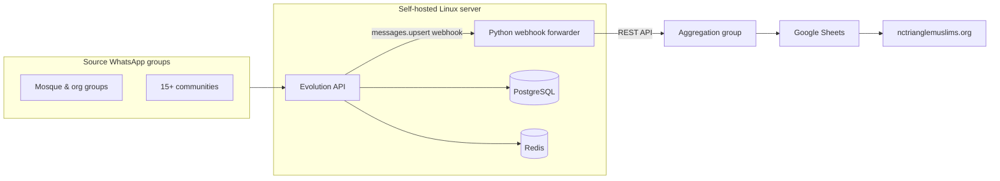

# NC Triangle Muslims — WhatsApp Event Aggregation Pipeline

Self-hosted automation that consolidates event announcements from independent mosque and community WhatsApp groups across the NC Triangle into a single channel, then feeds the public community calendar at [nctrianglemuslims.org/add-event](https://www.nctrianglemuslims.org/add-event).

**Organization:** [NC Triangle Muslims](https://www.nctrianglemuslims.org)

---

## Overview

Muslim communities in the Raleigh–Durham area operate dozens of separate WhatsApp groups for mosques, student associations, youth programs, and civic organizations. Event information is valuable but fragmented—easy to miss when it is spread across unrelated group chats.

This project implements a **self-hosted ingestion pipeline** on a dedicated Linux server that:

1. Connects to WhatsApp via a linked-device API ([Evolution API](https://github.com/evolution-foundation/evolution-api))
2. Monitors **15+ source groups** (JIAR, IAR, RISE, Young Muslims in Tech, Cary Masjid, and others)
3. Filters and forwards new messages (text and images) into a **single aggregation group**
4. Hands off to a downstream **Google Sheets** workflow that structures event data for the community website

The result is one reliable stream of community events without asking every organization to change how they already communicate.

---

## Architecture



| Layer | Technology | Responsibility |
|-------|------------|----------------|
| WhatsApp integration | Evolution API (Node.js / TypeScript) | Linked-device session, webhooks, message send/receive |
| Message routing | Python (`forwarder/`) | Filter by group JID, deduplicate, forward text/media |
| Persistence | PostgreSQL + Redis (Docker) | API state, message storage, cache |
| Orchestration | Bash (`scripts/`) | Start/stop/status for full stack |
| Downstream | Google Sheets + web app | Event structuring and public calendar UI |

---

## Infrastructure

The entire stack runs on a **self-hosted Linux server** (Ubuntu), deployed to a dedicated **1 TB SSD** mounted at `/mnt/1tb` for durable storage of the application, database volumes, and runtime logs.

| Decision | Rationale |
|----------|-----------|
| **Hybrid deployment** | Evolution API from **source** (editable, hot-reload) — PostgreSQL and Redis in **Docker** for isolation |
| **Webhook-driven routing** | Real-time `messages.upsert` events → Python service on port 5000 |
| **Environment-based secrets** | All credentials in `.env` (gitignored); Docker Compose reads `${POSTGRES_PASSWORD}` |
| **Deploy key authentication** | SSH deploy key for CI/CD-style pushes to GitHub without personal tokens on the server |
| **Operational scripts** | `start-all.sh` / `stop-all.sh` / `status.sh` for repeatable server management |

Server setup, fstab persistence, and troubleshooting are documented in [`docs/setup-plan.md`](docs/setup-plan.md) and [`docs/commands.md`](docs/commands.md).

---

## Technical highlights

- Designed and deployed a **multi-service pipeline** (API + database + custom forwarder) on bare metal
- Implemented **group-level filtering** using WhatsApp `remoteJid` identifiers across duplicate community group instances
- Built a **Python webhook consumer** with deduplication, media forwarding (`getBase64FromMediaMessage` → `sendMedia`), and configurable source/target group lists
- Configured **global webhooks** in Evolution API for event-driven message processing
- Established **secrets hygiene** for public repository publication (`.env.example`, `github-prep.md`, deploy keys)
- Documented end-to-end operations for reproducibility and handoff

**Stack:** Python 3 · Node.js 20 · TypeScript · PostgreSQL 15 · Redis 7 · Docker Compose · Bash · Evolution API / Baileys

---

## Repository structure

```
├── forwarder/              # Python webhook service (filter + forward logic)
├── scripts/                # Server orchestration (start / stop / status)
├── docs/                   # Setup guides, runbooks, group JID reference
├── docker-compose.deps.yaml  # PostgreSQL + Redis (API runs on host)
└── src/                    # Evolution API source (upstream fork)
```

| Document | Description |
|----------|-------------|
| [docs/commands.md](docs/commands.md) | Operational runbook — start each service individually or all at once |
| [docs/group-message-forwarder.md](docs/group-message-forwarder.md) | Forwarder design, filter rules, source group configuration |
| [docs/setup-plan.md](docs/setup-plan.md) | Server installation and debugging notes |
| [docs/github-prep.md](docs/github-prep.md) | Secrets management before public release |

---

## Getting started

```bash
git clone git@github.com:mdw223/evolution-api.git
cd evolution-api

cp .env.example .env
cp forwarder/config.example.yaml forwarder/config.yaml
# Configure POSTGRES_PASSWORD, DATABASE_CONNECTION_URI, AUTHENTICATION_API_KEY

npm install
docker compose -f docker-compose.deps.yaml up -d
export DATABASE_PROVIDER=postgresql
npm run db:generate && npm run db:deploy

./scripts/start-all.sh
./scripts/status.sh
```

Link a WhatsApp instance via QR code (`nc-triangle-muslims`), then verify the forwarder health endpoint at `http://localhost:5000/health`.

---

## Scope of this repository

| In scope | Out of scope (downstream) |
|----------|---------------------------|
| WhatsApp session management | Google Sheets automation |
| Source → aggregation group forwarding | Website frontend ([nctrianglemuslims.org](https://www.nctrianglemuslims.org)) |
| Server deployment & operations | AI/LLM event extraction (planned) |

---

## Upstream

Built on [evolution-foundation/evolution-api](https://github.com/evolution-foundation/evolution-api) (Apache 2.0). This fork extends the upstream project with community-specific automation, deployment tooling, and documentation for a production self-hosted instance.

Upstream documentation: [docs.evolutionfoundation.com.br](https://docs.evolutionfoundation.com.br)

---

## License

Apache 2.0 — see [LICENSE](./LICENSE). Evolution API is maintained by [Evolution Foundation](https://evolutionfoundation.com.br).
