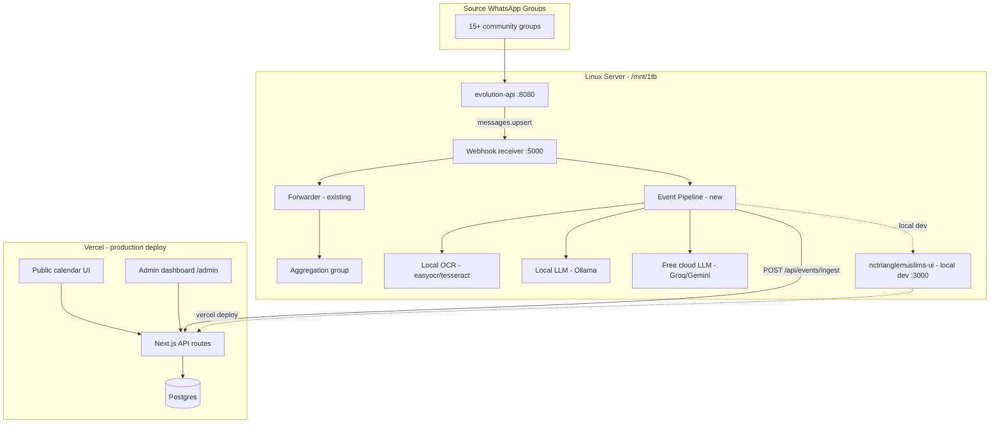

---

name: Event Pipeline to Postgres

overview: Build a multi-tier event detection and extraction pipeline on your Linux server (keyword → local LLM → free cloud LLM + local OCR), auto-publish structured events to Vercel Postgres via API, migrate existing Google Sheets data once, and add a spreadsheet-like React admin dashboard on the Vercel site.

todos:

- id: clone-ui-repo

content: Clone nctrianglemuslims-ui to /mnt/1tb/nctrianglemuslims-ui next to evolution-api; configure .env.local for local dev

status: pending

- id: vercel-schema-api

content: Create Vercel Postgres schema + public GET /api/events + authenticated POST /api/events/ingest

status: pending

- id: sheets-import

content: One-time Google Sheets → Postgres import script; switch public calendar to API

status: pending

- id: pipeline-tier1

content: Add event_pipeline module with keyword filter, EventData model, and Vercel ingest client

status: pending

- id: pipeline-tier2

content: Install Ollama + local LLM classify/extract with confidence thresholds

status: pending

- id: pipeline-ocr-tier3

content: Add local OCR for flyers + free cloud LLM fallback for incomplete extractions

status: pending

- id: webhook-dispatch

content: Update forwarder/app.py to run Forwarder + EventPipeline in parallel with shared dedup

status: pending

- id: admin-dashboard

content: Build /admin spreadsheet-like React table with edit/delete/hide on Vercel site

status: pending

- id: ops-hardening

content: pm2, SQLite dedup persistence, logging, and end-to-end test from source group to calendar

status: pending

isProject: false

---

  

# NC Triangle Muslims — WhatsApp Events to Vercel Postgres

  

## Decisions locked in

  

| Decision | Your choice |

|----------|-------------|

| Storage | **Vercel Postgres** + API backend (replace Sheets as source of truth) |

| Publishing | **Auto-publish** events that pass the trust filter; admin can edit/delete/hide via dashboard |

| Filtering | **3-tier**: keyword/dictionary → local model → free cloud LLM fallback |

| Flyers | **Local OCR** first; if fields incomplete → free cloud LLM (vision/text) fills gaps |

| Pipeline host | **Linux server** runs filter + extraction; **Vercel** stores and serves data |

| Message source | **Direct webhook** from source groups + **keep aggregation group** for human visibility (dedup by `messageId`) |

| Sheets migration | **One-time import** of existing rows; Sheets becomes archive |

| Admin UI | **Custom React** spreadsheet-like table at `/admin` on the Vercel site |

| Local dev layout | **Clone UI repo** to `/mnt/1tb/nctrianglemuslims-ui` alongside `evolution-api` |

  

---

  

## Local development layout

  

Clone the Vercel website project next to Evolution API so backend, admin dashboard, and pipeline can be developed on the same server:

  

```bash

cd /mnt/1tb

git clone git@github.com:nctrianglemuslims/nctrianglemuslims-ui.git

```

  

Resulting directory structure:

  

```

/mnt/1tb/

├── evolution-api/ # WhatsApp integration + forwarder + event pipeline

└── nctrianglemuslims-ui/ # Next.js site — Postgres API, public calendar, /admin dashboard

```

  

**Development workflow:**

  

- **UI / API / admin dashboard** — work in `/mnt/1tb/nctrianglemuslims-ui` (`npm run dev`, deploy to Vercel when ready)

- **Event pipeline** — work in `/mnt/1tb/evolution-api/forwarder/`; `ingest_client.py` POSTs to the Vercel API (production) or `http://localhost:3000/api/events/ingest` during local UI dev

- **Secrets** — UI repo gets `.env.local` (Postgres URL, `PIPELINE_API_KEY`, admin auth); pipeline config in `forwarder/config.yaml` references the same `PIPELINE_API_KEY`

  

---

  

## End-to-end architecture

  



  

**Dedup rule:** Track `whatsappMessageId` + `sourceGroupJid` in Postgres. Pipeline and forwarder share the same webhook payload; pipeline ignores messages already ingested.

  

---

  

## Phase 0 — Clone UI repo (prerequisite)

  

```bash

cd /mnt/1tb

git clone git@github.com:nctrianglemuslims/nctrianglemuslims-ui.git

cd nctrianglemuslims-ui

npm install

cp .env.example .env.local # if present; otherwise create from Vercel project env vars

```

  

- Ensure SSH deploy key or GitHub credentials can access `git@github.com:nctrianglemuslims/nctrianglemuslims-ui.git`

- Pull Vercel Postgres connection string and existing env vars from the Vercel dashboard into `.env.local`

- Run locally with `npm run dev` (typically `http://localhost:3000`) while building API routes and `/admin`

  

---

  

## Phase 1 — Vercel Postgres + public calendar cutover

  

**Repo:** [`/mnt/1tb/nctrianglemuslims-ui`](file:///mnt/1tb/nctrianglemuslims-ui) — cloned from `git@github.com:nctrianglemuslims/nctrianglemuslims-ui.git`, deployed to Vercel for production.

  

### 1a. Database schema

  

Mirror your current Google Sheets columns, plus pipeline metadata:

  

| Column | Type | Notes |

|--------|------|-------|

| `id` | uuid | Primary key (replaces `rowId`) |

| `createdAt` | timestamp | Was `Timestamp` |

| `eventName` | text | Required |

| `eventHostOrganization` | text | Map from `group_labels` when missing |

| `eventDate` | date | Required for publish |

| `requestorEmail` | text | Nullable for WhatsApp-sourced events |

| `eventDescription` | text | |

| `eventLocation` | text | |

| `eventStartTime` | time | |

| `eventEndTime` | time | |

| `flyerUrl` | text | Vercel Blob or S3 URL after upload |

| `updatesLink` | text | WhatsApp/form links from message |

| `status` | enum | `published` / `hidden` / `draft` — default `published` for auto-ingest |

| `featured` | boolean | Default `false` |

| `whatsappMessageId` | text | Dedup key |

| `sourceGroupJid` | text | |

| `sourceGroupName` | text | From forwarder `group_labels` |

| `confidenceScore` | float | 0–1 from pipeline tiers |

| `extractionTier` | text | `keyword` / `local_llm` / `cloud_llm` |

| `rawMessageText` | text | Audit trail |

  

Use **Drizzle ORM** or **Prisma** with Vercel Postgres.

  

### 1b. API routes (Next.js App Router)

  

| Route | Auth | Purpose |

|-------|------|---------|

| `GET /api/events` | Public | Calendar frontend — only `status=published` and `eventDate >= today` |

| `POST /api/events/ingest` | API key header | Pipeline writes new events (auto-publish) |

| `GET /api/admin/events` | Admin session | List all events (paginated, filterable) |

| `PATCH /api/admin/events/:id` | Admin session | Edit any column |

| `DELETE /api/admin/events/:id` | Admin session | Remove event |

| `POST /api/admin/events/:id/hide` | Admin session | Set `status=hidden` without delete |

  

**Ingest auth:** shared secret `PIPELINE_API_KEY` — pipeline sends `Authorization: Bearer <key>`.

  

### 1c. One-time Google Sheets import

  

Script in UI repo (`nctrianglemuslims-ui/scripts/import-sheets-to-postgres.ts` or one-off API route):

  

- Read all rows from existing Sheet (Google Sheets API + service account)

- Map columns 1:1 to Postgres schema

- Set `status=published` for rows that were live on the site

- Store original `rowId` in a `legacyRowId` column for traceability

  

### 1d. Public calendar frontend

  

Update the client-side calendar to fetch `GET /api/events` instead of Google Sheets. Keep the same UI; only the data source changes.

  

---

  

## Phase 2 — Event pipeline on Linux server

  

**Location:** extend [`forwarder/app.py`](file:///mnt/1tb/evolution-api/forwarder/app.py) to dispatch webhooks to both `Forwarder` (existing) and new `EventPipeline` in parallel — same port 5000, no extra Evolution config.

  

New module: `forwarder/event_pipeline/` (or sibling `pipeline/` folder):

  

```

forwarder/

event_pipeline/

__init__.py

classifier.py # Tier 1 keywords

local_llm.py # Tier 2 Ollama

cloud_llm.py # Tier 3 Groq/Gemini free tier

ocr.py # easyocr for flyer images

extractor.py # Structured JSON output

models.py # EventData dataclass matching Postgres schema

ingest_client.py # POST to Vercel /api/events/ingest

```

  

### Tier 1 — Keyword/dictionary filter (fast, free)

  

- Maintain `event_keywords.yaml`: Islamic event terms (`janazah`, `jummah`, `iftar`, `halaqa`, `masjid`, `program`, `registration`, `RSVP`, etc.) + date/time patterns

- Score message 0–1; pass to Tier 2 if score ≥ 0.3; hard-reject if score < 0.1

- Also pass **all image messages with captions** and **all standalone flyer images** regardless of score

  

### Tier 2 — Local LLM (Ollama on Linux server)

  

- Model: **Llama 3.2 3B** or **Phi-3 mini** via Ollama (runs on CPU, ~4GB RAM)

- Two prompts:

1. **Classify:** "Is this an event announcement?" → yes/no + confidence

2. **Extract:** Return JSON matching Postgres schema

- Publish if confidence ≥ **0.75**; else escalate to Tier 3

  

### Tier 3 — Free cloud LLM fallback

  

- **Groq** (Llama 3) or **Google Gemini free tier** for:

- Low-confidence Tier 2 results

- OCR-incomplete flyer fields (send image + OCR text)

- Publish if confidence ≥ **0.65**; else write as `status=draft` for admin review (safety net)

  

### Flyer / image handling

  

1. Download base64 from Evolution API (reuse existing [`forwarder.py`](file:///mnt/1tb/evolution-api/forwarder/forwarder.py) `_get_media_base64`)

2. Run **easyocr** locally → extract text

3. Merge caption + OCR text → feed to Tier 2

4. If required fields still missing (`eventName`, `eventDate`, `eventLocation`) → Tier 3 with image

5. Upload flyer image to **Vercel Blob** via ingest API (multipart) → store `flyerUrl`

  

### Trust filter before auto-publish

  

Auto-publish (`status=published`) only when **all** of:

  

- Classified as event (any tier)

- `eventName` and `eventDate` extracted

- `confidenceScore >= tier threshold`

- Not a duplicate (`whatsappMessageId` check)

  

Otherwise → `status=draft` (visible in admin only).

  

---

  

## Phase 3 — Admin dashboard

  

**Repo:** [`/mnt/1tb/nctrianglemuslims-ui`](file:///mnt/1tb/nctrianglemuslims-ui)

  

**Route:** `/admin` — password-protected (NextAuth with allowlisted admin emails, or simple env-based admin password for MVP).

  

**UI:** Spreadsheet-like React table (recommend **TanStack Table**):

  

- Inline edit cells (click to edit, blur to save)

- Columns match Postgres schema (same headers as old Google Sheet)

- Actions: Delete row, Hide (toggle `status`), Feature (toggle `featured`)

- Filter tabs: All / Published / Hidden / Draft

- No SQL, no technical jargon — labels match the old Sheet ("Event Name", "Event Date", etc.)

  

---

  

## Phase 4 — Operations and hardening

  

| Task | Detail |

|------|--------|

| pm2 | Add event pipeline + Ollama to [`scripts/start-all.sh`](file:///mnt/1tb/evolution-api/scripts/start-all.sh) |

| Dedup persistence | Replace in-memory `seen_ids` with SQLite file for pipeline (survives restarts) |

| Logging | Log each tier decision + confidence to `logs/event-pipeline.log` |

| Rate limits | Cap cloud LLM calls at ~50/day (well above your ~20 msgs/day) |

| E2E test | Send test event message in source group → appears on public calendar within ~30s |

  

---

  

## What stays in which repo

  

| Component | Local path | Remote |

|-----------|------------|--------|

| Webhook receiver + forwarder + event pipeline | [`/mnt/1tb/evolution-api`](file:///mnt/1tb/evolution-api) (`forwarder/`) | `git@github.com:mdw223/evolution-api.git` |

| Postgres schema, API, public calendar, admin UI | [`/mnt/1tb/nctrianglemuslims-ui`](file:///mnt/1tb/nctrianglemuslims-ui) | `git@github.com:nctrianglemuslims/nctrianglemuslims-ui.git` |

| One-time Sheets import script | `nctrianglemuslims-ui/scripts/` | Same UI repo |

| Production hosting (UI + API + Postgres) | — | Vercel |

  

---

  

## Recommended build order

  

0. **Clone `nctrianglemuslims-ui`** to `/mnt/1tb` — local dev for backend + admin dashboard

1. **Vercel Postgres schema + ingest API** — pipeline has somewhere to write

2. **One-time Sheets import + switch public calendar to API** — site works before pipeline

3. **Tier 1 keyword filter + ingest client** — prove end-to-end with manual keyword hits

4. **Ollama + Tier 2 extraction** — core intelligence

5. **OCR + Tier 3 cloud fallback** — handle flyers

6. **Admin dashboard** — admin override layer

7. **Wire parallel dispatch in `app.py`** — production cutover

  

---

  

## Cost and environment notes

  

- ~20 messages/day → free-tier Groq/Gemini is effectively $0

- Local Ollama = no per-message API cost, runs on your existing server

- Cloud LLM only for ~10–30% of messages (low-confidence + incomplete OCR) → minimal environmental impact vs. sending everything to cloud

- No training data contribution if you use Groq (check ToS) or run Ollama locally

  

---

  

## Risks to plan for

  

- **False positives** auto-published → mitigated by confidence thresholds + admin dashboard to hide/delete

- **Flyer-only posts with bad OCR** → Tier 3 vision + `draft` fallback

- **Islamic terminology edge cases** → maintain keyword list collaboratively; tune local LLM prompt with 10–20 real examples from your groups

- **WhatsApp flyer as PDF/document** → handle `documentMessage` with image mimetype (forwarder already does)