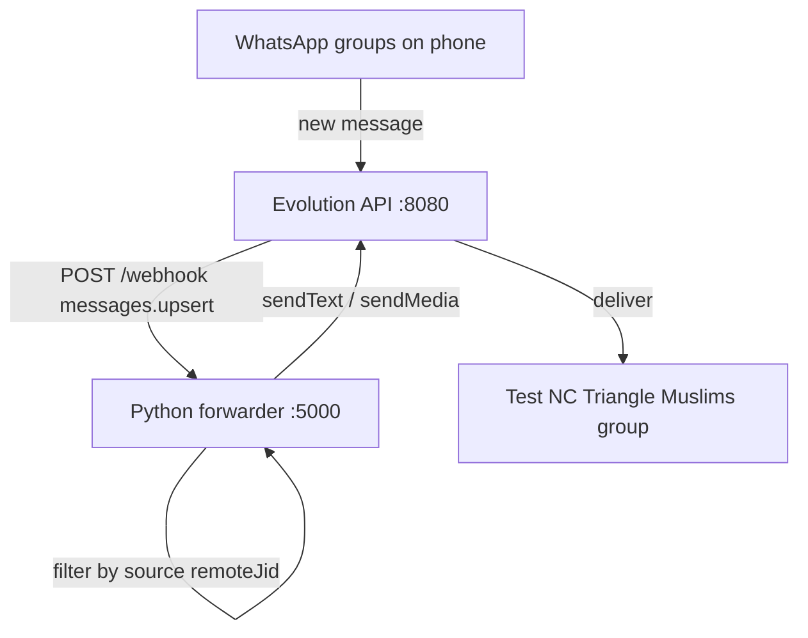

# Phase 2 — Group Message Forwarder

## Your current status (answered)

| Observation | Explanation |
|-------------|-------------|
| `state: "open"` | WhatsApp is linked — setup step 1 is done |
| Webhook `ECONNREFUSED 127.0.0.1:5000` | **Expected** — `WEBHOOK_GLOBAL_URL` points to port 5000 but no Python app is running yet. Evolution retries 10x; harmless but noisy |
| UI shows no messages synced | **Mostly yes — new messages only.** `messages.upsert` fires for messages arriving **after** connection. Old chat history may sync slowly via `messages.set` (if `DATABASE_SAVE_DATA_HISTORIC=true`), but the forwarder should not rely on history. **Send a test message in a source group** to verify |

The webhook errors will stop once the Python listener is running.

---

## Architecture



**Instance:** `nc-triangle-muslims`  
**Config location:** `/mnt/1tb/evolution-api/forwarder/` (new folder, separate from Evolution source)

---

## Step 1 — Discover group JIDs (one-time)

Groups are identified by `remoteJid` (e.g. `120363417012345678@g.us`), **not** by display name.

```bash
cd /mnt/1tb/evolution-api
APIKEY=$(grep AUTHENTICATION_API_KEY .env | cut -d= -f2)

curl -s "http://localhost:8080/group/fetchAllGroups/nc-triangle-muslims?getParticipants=false" \
  -H "apikey: $APIKEY" | jq '.[] | {subject, id}'
```

From the output:

1. Note the `id` (JID) for **Test NC Triangle Muslims** → `TARGET_GROUP_JID`
2. Pick source community groups → `SOURCE_GROUP_JIDS` (list)

Save these in `forwarder/config.yaml`:

```yaml
instance: nc-triangle-muslims
evolution_url: http://localhost:8080
api_key: <from .env>

target_group_jid: "120363429717652375@g.us"   # Test NC Triangle Muslims

# 14 groups, 18 JIDs — includes duplicate/old JIDs for same display names
source_group_jids:
  # JIAR Community (2 JIDs)
  - "120363285627401888@g.us"   # JIAR Community
  - "120363285906619839@g.us"   # JIAR Community (duplicate)

  # RISE Community (2 JIDs)
  - "120363239021947902@g.us"   # RISE Community
  - "120363220181471302@g.us"   # RISE Community (duplicate)

  # IAR (2 JIDs)
  - "120363151179725752@g.us"   # IAR
  - "120363133426120923@g.us"   # IAR (duplicate)

  # The Light House Project (2 JIDs)
  - "120363150289368320@g.us"   # The Light House Project
  - "120363151962058789@g.us"   # The Light House Project (duplicate)

  # Single JID groups
  - "120363394578390263@g.us"   # Madinah Quran & Youth Center MQYC
  - "120363042013154928@g.us"   # Cary Masjid Youth Updates
  - "120363401702236464@g.us"   # Islamic Center of Clayton
  - "19198889201-1631039817@g.us"   # AMYC Announcements
  - "120363149724432358@g.us"   # IAR Janazah Alert 1
  - "19194378751-1611302422@g.us"   # IAR Youth Programs
  - "120363404196239378@g.us"   # Young Muslims in Tech (YMT)
```

> **Note:** JIAR, RISE, IAR, and The Light House Project each appear twice in `fetchAllGroups` with different JIDs (likely community sub-groups or old+new groups). All variants are included so messages from either are forwarded.

---

## Step 2 — Python webhook forwarder

Create `/mnt/1tb/evolution-api/forwarder/` with:

| File | Purpose |
|------|---------|
| `app.py` | stdlib HTTP server, `POST /webhook` + `GET /health` |
| `config.yaml` | Source + target JIDs, group labels, API key |
| `requirements.txt` | `pyyaml`, `requests` (no Flask — uses stdlib) |
| `forwarder.py` | Filter + forward logic |

### Webhook payload shape (Evolution API v2)

Evolution POSTs JSON like:

```json
{
  "event": "messages.upsert",
  "instance": "nc-triangle-muslims",
  "data": {
    "key": { "remoteJid": "120363...@g.us", "fromMe": false, "id": "..." },
    "pushName": "Sender Name",
    "messageType": "conversation",
    "message": { "conversation": "Hello" }
  }
}
```

### Filter rules (in order)

1. `event == "messages.upsert"` (ignore `messages.update`, etc.)
2. `data.key.remoteJid` in `source_group_jids`
3. `data.key.fromMe == false` (skip your own messages) — set `forward_own_messages: true` in config to allow your own messages (useful for testing)
4. `data.key.remoteJid != target_group_jid` (loop prevention)
5. Deduplicate by `message.key.id` (in-memory set or short TTL cache)

### Forward text

```bash
POST /message/sendText/nc-triangle-muslims
{
  "number": "<TARGET_GROUP_JID>",
  "text": "[GroupName] Sender: message text"
}
```

`number` accepts full group JID for groups.

### Forward images

For `messageType` in `imageMessage`, `documentMessage` (image mime):

1. `POST /chat/getBase64FromMediaMessage/nc-triangle-muslims` with the message `key` from webhook
2. `POST /message/sendMedia/nc-triangle-muslims` with `mediatype: "image"`, `media: <base64>`, `caption: "[Group] Sender: ..."`

---

## Step 3 — Run the forwarder

### All-in-one (recommended)

See **[commands.md](commands.md)** for full run/stop reference.

```bash
/mnt/1tb/evolution-api/scripts/start-all.sh   # Docker + Evolution API + forwarder
/mnt/1tb/evolution-api/scripts/status.sh      # check what's running
/mnt/1tb/evolution-api/scripts/stop-all.sh    # stop everything
```

Logs: `/mnt/1tb/evolution-api/logs/evolution-api.log` and `forwarder.log`

### Forwarder only

```bash
cd /mnt/1tb/evolution-api/forwarder
python3 app.py   # listens on 0.0.0.0:5000
```

Evolution API webhook errors should stop immediately.

For 24/7: run under `pm2` or `systemd` alongside Evolution API.

Watch logs live:
```bash
tail -f /mnt/1tb/evolution-api/forwarder/forwarder.log
```
---

## Step 4 — Test end-to-end

1. Start Python forwarder on port 5000
2. Send a text message in one of your **source** groups from another phone (or ask someone)
3. Confirm it appears in **Test NC Triangle Muslims**
4. Send an image in a source group — confirm image forwards
5. Check Evolution logs — no more `ECONNREFUSED` errors

**Quick webhook debug** — log all incoming payloads before filtering:

```python
@app.post("/webhook")
def webhook():
    payload = request.get_json()
    print(json.dumps(payload, indent=2))  # remove after debugging
    ...
```

---

## Step 5 — Loop prevention checklist

Without this, forwarded messages could re-trigger the forwarder:

- Never include `target_group_jid` in `source_group_jids`
- Skip `fromMe: true`
- Prefix forwarded messages with source group name so you can spot loops
- Optional: skip messages containing your forward prefix

---

## Optional improvements (later)

- **pm2** for forwarder + Evolution API
- **SQLite log** of forwarded message IDs (survives restarts)
- **AI pipeline** hook inside forwarder before sending to target group
- **Mute webhook noise** during dev: set `WEBHOOK_GLOBAL_ENABLED=false` until forwarder is ready (reduces log spam)

---

## Files to create

- [`/mnt/1tb/evolution-api/forwarder/config.yaml`](/mnt/1tb/evolution-api/forwarder/config.yaml)
- [`/mnt/1tb/evolution-api/forwarder/app.py`](/mnt/1tb/evolution-api/forwarder/app.py)
- [`/mnt/1tb/evolution-api/forwarder/forwarder.py`](/mnt/1tb/evolution-api/forwarder/forwarder.py)
- [`/mnt/1tb/evolution-api/forwarder/requirements.txt`](/mnt/1tb/evolution-api/forwarder/requirements.txt)

Update [`/mnt/1tb/evolution-api/docs/setup-plan.md`](/mnt/1tb/evolution-api/docs/setup-plan.md) progress checklist when phase 2 is done.

---

## API reference (quick)

| Action | Method | Endpoint |
|--------|--------|----------|
| List groups | GET | `/group/fetchAllGroups/nc-triangle-muslims?getParticipants=false` |
| Send text | POST | `/message/sendText/nc-triangle-muslims` |
| Send image | POST | `/message/sendMedia/nc-triangle-muslims` |
| Download media | POST | `/chat/getBase64FromMediaMessage/nc-triangle-muslims` |
| Webhook (Evolution → you) | POST | `http://localhost:5000/webhook` |

All Evolution API calls need header: `apikey: <AUTHENTICATION_API_KEY>`
